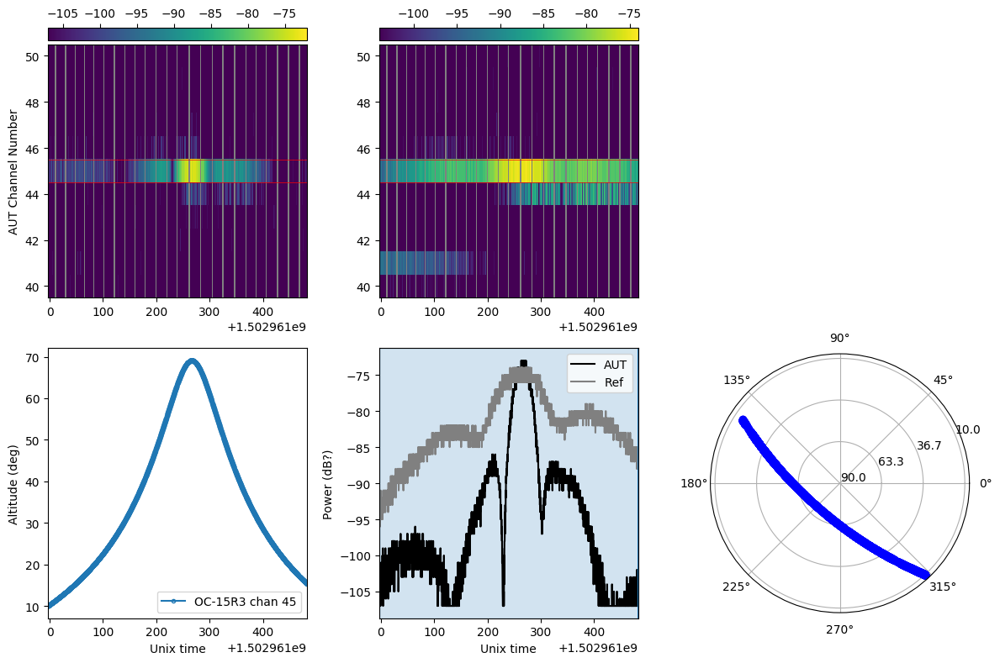

# Running the beam code
Right, the code is a little all over the place, so I've chucked together a document that at least tells you what order things should be run in, and in theory what each piece of code is doing. There are some locations that have been hardcoded in - I'll try and snuff them out and make everything relative to within this git repo, but I might miss some stuff.

I'm going to move around from folder to folder, so will do some cd-ing in between. There are a number of steps to get to the final beam plots, some of which require some painful explanations of work arounds of problems, so please bear with me. I've also chucked in some **TODO**s anytime I've thought of what needs to be improved/thought about/changed for this time round. If it's something I need to do, I've put **TODO JACK**.

## 1. Handling raw data
First up we'll head here, assuming you start in the base directory of the repo, use:
```sh
cd ./code/align_data
```
There is some example raw data here in the folders ``./data_refs`` and ``./data_tiles``, which are the files that are dumped out by the RF explorers for the reference dipoles and tiles, respectively. Just two hours worth of data here - each data dump is a half hour long.

### Plotting raw data
First thing to do is check out a waterfall of the raw data (look in the bash script to check out what command and args are being called):
```sh
source  plot_waterfall.sh
```
which should produce two plots, one of which (S21_waterfall_2017-08-17-16:20.png) looks like this:


This is a sweet diagnostic that we will be running on site to ensure we are capturing data correctly. Those two vertical stripes are a single satellite pass going through the tile beam, and you can even make out the nulls in the beam during the pass. Coool.

### Fomatting raw data
As discussed in the beam paper in Sec 3.1, the data can be offset in time by 0.1 - 0.5s, and so had to time aligned - "We then took a mean $\mu_t$ and standard deviation
$\sigma_t$ of all $t_{off}$ and required for a data point to match between the
reference and AUT, such that $t_{off} < \mu_t +\sigma_t$". The time matching is done using this command:
```sh
source align_data.sh
```
`align_data.py` reads in reference antenna data, and 'Antenna Under Test' (AUT) data, which is the tile data, and time aligns them. It also calls code that looks in the www.space-track.org online database to find satellite passes that coincide with the data, and downloads their emphemeris data into the `TLE` directory. When you run it, it should spit out lots of words saying it's interrogating the space track website, and checking the 'database', which is just text files inside `TLE`. It will take some time. I didn't write this satellite finding code so not fully sure how it works - I just hacked it into this `align_data.py` script. `align_data.py` has a few hard-coded lists inside:
```python
AUT_tile_list = ['S21','S22','S23','S24']
ref_tile_list = ['rf0','rf1']
sat_list=['OC-G2','OC-A1','OC-A2','OC-A3','OC-A4'...]
```
Which means it will match reference dipoles 'rf0','rf1' to tiles 'S21'..., and look up satellite data for all the satellites listed in `sat_list`. Once everything is matched into nice arrays, I dump it out into a compressed `.npz` save file in the `aligned_data` dir.

>**TODO**: There may be new ORBCOMM satellites out there we can take advantage of, so this list needs to be checked and possibly expanded. And those hardcoded lists are a little pants, you might want to make them options for flexibility
>
>**NB**/**TODO** - I did all of this processing on a supercluster last time as it can take a while, and the aligned data set ended up quite large - from our ~400 hours of raw data, the aligned data set ended up about 140GB. This is for XX pol of 8 tiles, time matched to both referece dipoles, and well as the null test for the two references. You could think of a more data efficient way of doing this, and/or just process everything on ozstar.

## 2. Reference dipole models
Ok, if we go into
```sh
cd ./code/reproject_ref
```
we find the reference dipole models we had to generate (see Section 4.1 of the paper) for the current configuration. These were in `.ffe` format used by FEKO, so I knocked up a script that finds the power of the beam, interpolates it and rotates them correctly into the healpix projection we use to do our analysis in. If we fiddle with the reference antennas, we will need to remodel the beams (someone here at Curtin can do that). At the momeent you just do
```sh
python project_beams2healpix.py
```
which creates `ung_dipole_models.npz`, which contains the projected reference models. However, these are just for the XX polarisation. It also makes this diagnostic plot, which shows the model in `.ffe` projection top row, and healpix projection bottom row reproject_dipole_models.png:


>**TODO JACK** ask if Dan still has the YY equivalent beams and get hold of them \
>**TODO** Project the YY beams onto healpix by hopefully just dropping the `.ffe` into the current script. Getting the alignment of the model (i.e. $\theta=0$ pointing in the correct E/W/N/S direction) is tricky, so the alignment of the new YY dipole models will need to be checked against the reference dipole data, once it has been taken.

## 3. Null test and error estimate
Here is a lesson in version control: do it. All the time. This code was in a Dropbox, and for some reason, the folder
```sh
cd ./code/null_test
```
has gone, vanished into the ether. I can only apologise. This folder was responsible for creating Figure 4 in the paper, where we took the raw data from the reference antennas, fitted them, and compared them to the FEKO models. Won't be too hard to duplicate as I think I was quite explicit in what I did in the paper, and you can use the 'mapping data into healpix' part of the code used in Sec 4 of this document as a base, but it's annoying.

We use the differences we see in Figure 4 to plot a shaded error estimate in Figure 7 as well, which I think is good, so I would vote you do something similar this time round. Last time round I generated `.npz` which contained the values to plot in Figure 7 - I've made a place holder for now to check all the other code works.

>**TODO JACK** sort my life out - I might be able to write this code when we are onsite in the evenings \
**TODO** rewrite this code, and improve the analysis of it as you see fit

## 4. Applying noise criteria and dividing out satellites
The is the real wheel house of the code. This is the part that divides the AUT data by the reference data, after applying the noise criteria detailed in Section 3.1 of the paper. This all happens inside
```sh
cd ./code/divide_out_sats
```
and the heavy lifting done by the script `divide_out_sats.py`. Example commands that run on the small amount of data included in this git repo can be run using:
```sh
source run_divide_out_sats_rf0XX.sh
```
where the resulted output data is output into `rotated_sat-removed_full_AUT_*_ref_*.npz` and `rotated_sat-removed_med_AUT_*_ref_*.npz` where the former contains an 2D array, where each row contains every satellite pass that fell inside each every healpixel, and the latter contains a 1D array, where I've taken the median value for each pixel. Equivalently, the script `run_divide_out_sats_rf1XX.sh` does the same, using the other reference dipole.

>**TODO** this is the biggest TODO in my opinion. Inside `divide_out_sats.py` there is a dictionary that looks like this:
>
>```python
>chans_dict={'OC-G2':43,'OC-A1':4,'OC-A2':4,'OC-A3':52,'OC-A4':52,'OC-A5':4...}
>```
>
>where we hardcoded the frequency channel we expect each satellite to tramsit at. As discussed in the paper, we got these channels from eyeballing waterfall plots and matching them with satellite emphemeris, but the satellites sometimes change their transmitting frequencies. It would be far more robust to interrogate the actual data when we know a satellite is overhead, and select the frequency channel based on the brighest channel.

Ok there are a couple of diagnostic plots you can create with using `divide_out_sats.py`. The first option uses the `--plot_sat_passes` options, which for every satellite pass will create a plot like this (explore_data_S21XXrf0XX_OC-15R3_chan045_1502960996.png):



The top two panels are waterfalls of the raw time-matched data for the tile (the AUT) and reference antenna (hence the grey missing chunks where the time is too out of sync). Bottom left is the altitude of the satellite with time, bottom middle is the power with time in the selected frequency channel (which is highlighted in red on the top plots), and bottom right is the emphemeris of the pass on the sky.

The next type of plot is output using the `--plot_noise` option, and let's you look at the noise threshold cutoff for each satellite pass, which you control using the `--mad_threshold` argument, looks like this (noise_OC-15R3_1502960996.png):


I used these two diagnostic plots to work out sensible noise cutoffs offs, and especially the first one to eyeball any bad passes. Problems happen for a few reasons:

1. Sometimes a satellite very close to the altitude limit (above 10 degrees was my cutoff) looked pretty much like noise and caused badness
2. Out hard frequency channel selection was wrong
3. There are instances of two satellites trasmitting at the same time and overlapping

To overcome this, I enabled an option `--skip_list`, which I fed a list (`skip_list_rf0XX.txt`) the contents of which look like:

```
OC-A3 1503143774
OC-A3 1503963998
OC-A4 1503906478
OC-A6 1503399523
OC-A6 1503909515
...
```
which are satellite names and unix times that match the `explore_data*.png` plots. Brute force but effective.

You can also then run commands like in
```sh
source plot_healpix_from_npz.sh
```

which will produce a tester beam plot. With the limited data in this git repo it looks pretty sparse (rotated_sat-removed_full_AUT_S21XX_ref_rf0XX.png):


You probably can't tell from the plot above, but this is actually rotated by 45 deg compared to the final beam plot (which is why the .npz outputs are labelled rotated) - the reason is in the next section. The full plot looks like this:


## 5. Rotate beams and slice
Ok so in Figure 7 of the paper, we plot nice slices through east-west and north-south directions of the map. Healpix n32 annoyingly does not have straight lines of pixels through the centre horizontally or vertically, but it does have them diagonally.

So we've rotated the data using `divide_out_sats.py`, as well as dividing the tile data by the antenna data. But from Equation 1 in the paper, we still need to multiply by the reference beam model. Which means we need to rotate the reference beam and make sure it lines up with the divided map. In here:
```sh
`cd ./code/rotate_ref_and_reformat`
```
we rotate the reference beam models, convert things into dB (it was in Watts in the code I adapted), find errors on stuff, and shoves it into collated `.npz` files that we can finally use for plots.

First up we run
```sh
python get_reference_med_data.py
```
which finds and formats the median of the measured reference beams for error propagation reasons. Once that's done we run: reformat_beams.py, which
```sh
python reformat_beams.py
```
which rotates and matches the reference beams (this took trial and error to match the simualted reference beams to the orientations we saw in the raw data), and grabs errors, data, and models, and puts them into collated `prerotated*.npz` files. These are then used in the next folder to do nice (well I think so at least) plots and finally get some results.

>**TODO** if you want to open up a can of worms, work through all the rotations and check they are all legit

## 6. Apply reference model and plot
Alright, final folder of code is:
```sh
`cd ./code/apply_reference`
```
inside this folder are a few predefined `.npz` files (apparently I love these things) that contain healpixel indexes so we can perform slices and grab data above an altitude of 9 deg. Ok the first script
```sh
python apply_reference_prerotated.py
```
generates plots for individual tile beams that with your example data should look like this `prerotated_fitted_beam_S22XX.png`:


Looks way cooler with all the data `prerotated_fitted_beam_S22XX_full.png`:


There are a number of things this script has to do. First, it needs access to the fully embedded element MWA beam model for comparison. You can download that from this git repo: https://github.com/MWATelescope/mwa_pb.git. You also need to get your hands on the raw data for the beam, which is too big to go into a normal github. You can find a copy on ozstar here `/fred/oz048/MWA/CODE/MWA_Tools/mwapy/data/mwa_full_embedded_element_pattern.h5`. You'll need to edit the top of this scripts so it can find the modules/files.

This script multiplies through by the reference beam model, which happens on line:249 ```corrected_map = divided_map + reference```. Everything is in dB, which is logarithmic, so here the addition means a multiplication in power. Confused me looking back on this anyways.

It also does a gain fit of the measured beam pattern to the model pattern, to match the normalisations, after doing the east-west / north-south slicing.

Also worth noting that tile `S21` had the missing dipole, and so when I use the function `local_beam` to calculate the model beam, I modify the `amps` array, which is usually just ones, to have a single zero in the XX pol, which kills the correct dipole to make the correct beam map for `S21`. Man this was more complicated than I remembered.

I've shoved comments in `apply_reference_prerotated.py`, but not really the next set of scripts. They do the same thing as inside `apply_reference_prerotated.py`, just for multiple tiles to generate groupings of plots.

Ok so then there is a script which plots the 4 tiles grouped together, to make Figures 6 and 7 in the paper
```sh
python plot_maps_grouped_good-maps.py
```
should output plots like `good_beammaps.png`, `good_EW_slice.png`, `good_NS_slice.png`


with the dummy data. And then to produce the difference maps you run
```sh
python plot_maps_grouped_good-maps_diffs.py
```
which makes `good_diffmaps.png`


To make Figure 5, which compares maps of the FEE model to beam maps, you run
```sh
python model_comparison.py
```

which generates `FEE_comparison_maps.png`


There is also a script
```sh
python measure_good_beam_model_offsets.py
```
which seems to measure the median offset of the east-west slice and median absolute deviation, as it prints out `OVERALL EAST-WEST OFFSETS 5.0$\pm$1.9` for the example data. Must have had to put that number in the paper, or the referee asked for it. Dunno might be useful to you

>**TODO** there are probably a number of scripts that could be merged to make this whole process more efficient, unfortunately this code evolved organically to absorb the problems of the reference antennas, timing mismatches etc that we didn't forsee.

## NEW stuff you'll need to think about
1. Do you want to try and fix up the reference dipoles to be symmetric? If you do that, we'll have to run new simulations of the reference antennas. I'm wary of moving stuff we know works, but I can imagine a referee asking why we didn't solve known systematics.

2. Where are you going to store the data? Raw data is actually quite small, but it's nice to pull data off the raspberry pis often (which you can do via ssh) - last time I setup an rsync, pulled the data to a super cluster, and then deleted the data off the raspberry pi every few days to be sure we didn't run out of space

3. Last time, the array was stuck pointed at zenith. This time, we'll just be piggy-backing on normal observations, so the telescope will be changing pointing at it's own leisure. So you'll need to get metafits data on the pointings and group together the data by pointing

4. We should ask the obs team which tiles have what missing dipoles to make matching beam models easier
